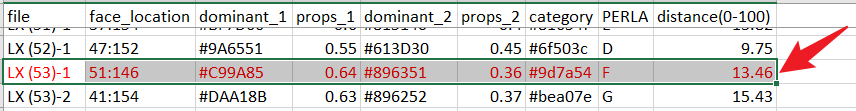

# <u>S</u>kin <u>Tone</u> Classifier (stone)

## Installation

### 1. Configure python environment

Please install **Miniconda** based on your OS following [this link](https://docs.conda.io/en/latest/miniconda.html#latest-miniconda-installer-links), e.g.,

#### For Windows

1. Download Miniconda from [here (64-bit)](https://repo.anaconda.com/miniconda/Miniconda3-latest-Windows-x86_64.exe) or [here (32-bit)](https://repo.anaconda.com/miniconda/Miniconda3-latest-Windows-x86.exe).
2. Install Miniconda
   1. Open the .exe file and click <kbd>Next</kbd> or <kbd>I Agree</kbd> if there are no options in the dialog.
   2. Choose "Just Me" in this step: 
      
      
   3. Check and Uncheck the boxes as shown below before installing it: 
      
      
   4. Uncheck the boxes and click <kbd>Finish</kbd>: 
      
      

#### For macOS

1. Download Miniconda from [here (intel)](https://repo.anaconda.com/miniconda/Miniconda3-latest-MacOSX-x86_64.pkg) or [here (M1)](https://repo.anaconda.com/miniconda/Miniconda3-latest-MacOSX-arm64.sh).
   1. As I tested on my side, for macOS built on M1 chips, you choose `bash` installation script instead of `pkg` version.  
2. Install Miniconda via `bash` script:
   1. Open "Terminal" app: Click the Launchpad icon  in the Dock, type "Terminal" in the search field, then click "Terminal".
      
      
   2. Navigate to the folder of the downloaded file us `cd` command.
      1. `cd` means "**C**hange **D**irectory". Suppose the `Miniconda3-latest-MacOSX-arm64.sh` is in `~/Downloads`, you should run:
      ```shell
      cd ~/Downloads
      ```
   3. Run `bash` command to install Miniconda
      ```shell
      bash Miniconda3-latest-MacOSX-arm64.sh
      ```
   4. Follow the prompts on the installer screens and just accept the defaults settings, you may need to keep pressing <kbd>return</kbd> on your keyboard or type "yes" several times.

      
   5. Close the Terminal and reopen it again (**IMPORTANT!**). Then you will see `(base)` at the beginning of a command line:
      
      

### 2. Install SkinToneClassifier

1. Open the terminal app
   1. For Windows, please open "Anaconda Powershell Prompt": 
      
      
   2. For macOS, please open "Terminal" app .
2. Copy and run the following command in the terminal.
   ```shell
   pip install -U skin-tone-classifier
   ```
   E.g., for Windows: 
   
   
   
   Please confirm the version of the library is >= 0.1.9, you can recheck it by running:
   ```shell
   pip show skin-tone-classifier 
   ```
   You can see the output like: 
   
    

## Get Started

Now, you can use `stone` command to process images, please refer to [this link](https://chenglongma.com/SkinToneClassifier/) for detailed usage.
Here, I just show a use case for the paper.

Given a folder of images, e.g., `Portraits_LX` and an excel file, e.g., `Database_LX Legislatura_CASCo.xlsx`, we now process the images first.

1. Let's navigate to the folder of `Portraits_LX`. Suppose the files are in `~/Downloads`, please run:
   ```shell
   cd ~/Downloads
   ```
   - **NOTE**: `~/` represents your home directory, it is equivalent to `C:\Users\<YOUR_USER_NAME>\` in Windows or `/Users/<YOUR_USER_NAME>` in macOS.
2. Run `stone` with the following command:
   ```shell
   stone -i ./Portraits_LX -d
   ```
   - `-i` is used to specify the location of images to process; 
   - `-d` means `debug` mode, `stone` will generate processed images, and we can verify if the result is correct.
3. Wait for the results, and you can find the following outputs:
   1. `./debug` folder: it contains all processed images with detected faces and color category.
   2. `./log` folder: it contains the running logs.
   3. `./result.csv`: it contains the summary of each image.
4. Check if the faces were detected correctly.
   1. Open `./debug` folder, you can find the processed images with a suffix `-1` or `-2`. The suffix means the index of faces detected by `stone`.
   2. Please check those images with multiple suffixes manually as the library can be confused by some "faces".
      E.g., in `LX (53)-1.jpg` and `LX (53)-2.jpg`, `LX (53)-2.jpg` was detected correctly.

       
   3. Then we should remove the corresponding entry of `LX (53)-1.jpg` in `result.csv`.
      
      
   4. For those entries in `result.csv` where the `face_location` column value is `NA`, it means the library cannot find any faces in the image.
      However, the library will check its global skin color instead. The results would be less accurate but not so bad.
      If you want to tune the library with advanced parameters, please let me know.
5. Merge the results into `Database_LX Legislatura_CASCo.xlsx`.
   - Since the latest version (0.1.9+), the library can sort the files by the numerical values in their filename.
     
     E.g., `LX (1).jpg`, `LX (2).jpg`, `LX (100).jpg` would be in correct order instead of `LX (1).jpg`, `LX (100).jpg`, `LX (2).jpg`.
   - When we have completed the previous step, now column "PERLA" of the two files should correspond to each other, we can copy it directly from `result.csv` to `Database_LX Legislatura_CASCo.xlsx`.
6. Now we have done all the work 🎊.